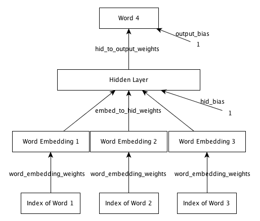
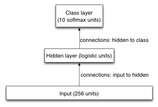

# Neural Networks for Machine Learning - Geoffrey Hinton
## Coursera
(https://class.coursera.org/neuralnets-2012-001)

Created by: Won Seok, Choi

Work Through Date: '17. 3. ~

Version: Matlab


### Project 1 - The perceptron learning algorithm
In this assignment you will take the provided starter code and fill in the missing details in order to create a working perceptron implementation.

To load the data set, go to an octave terminal and cd to the directory where the
downloaded data is located. Type
```shell
> load ./Datasets/dataset1
```

The variables have *_nobias* appended to their names because they do not have an additional column of 1's appended to them. This is done automatically in the learn_perceptron.m code already. Now that you have loaded a dataset, you can run the algorithm by entering the following -
```shell
> w = learn_perceptron(neg_examples_nobias, pos_examples_nobias, w_init, w_gen_feas)
```


### Project 2 - Learning Word Representations
In this assignment we will design a neural net language model. The model will learn to predict the next word given the previous three words.



To load the data set, go to an octave terminal and cd to the directory where the
downloaded data is located. Type
```shell
> load data.mat
```
This will load a struct called 'data' with 4 fields in it.
You can see them by typing
```shell
> fieldnames(data)
```
'data.vocab' contains the vocabulary of 250 words. Training, validation and
test sets are in 'data.trainData', 'data.validData' and 'data.testData'  respectively.
To see the list of words in the vocabulary, type -
```shell
> data.vocab
```
'data.trainData' is a matrix of 372550 X 4. This means there are 372550
training cases and 4 words per training case. Each entry is an integer that is
the index of a word in the vocabulary. So each row represents a sequence of 4
words. 'data.validData' and 'data.testData' are also similar. They contain
46,568 4-grams each. All three need to be separated into inputs and targets
and the training set needs to be split into mini-batches. The file load_data.m
provides code for doing that. To run it type:
```shell
> [train_x, train_t, valid_x, valid_t, test_x, test_t, vocab] = load_data(100);
```
This will load the data, separate it into inputs and target, and make
mini-batches of size 100 for the training set.

train.m implements the function that trains a neural net language model.
To run the training, execute the following -
```shell
> model = train(1);
```


### Project 3 - Optimization and Generalization
In this assignment, you're going to train a simple Neural Network, for recognizing handwritten digits. You'll be programming, looking into efficient optimization, and looking into effective regularization.



To keep things as simple as possible, we're not including biases in our model. In the diagram you can see that this model is significantly simpler than the model that we used in programming assignment 2.

To run with many regularization techniques -
```shell
> a3(1e7, 7, 10, 0, 0, false, 4) % each input correspond with regularization techniques
```


### Project 4 - Restricted Boltzmann Machines
This assignment is about Restricted Boltzmann Machines (RBMs). We'll first make a few basic functions for dealing with RBMs, and then we'll train an RBM. We'll use it as the visible-to-hidden layer in a network exactly like the one we made in programming assignment 3 (PA3).

For PA3, there was (and still is) a great deal of very good discussion going on, on the forum. Students learned a lot, helped others a lot, figured things out together, and provided valuable feedback. I want to thank everybody who participated in that discussion. I would never have been able to respond to every question, comment, and request for clarification on my own, but because of the community of this course, I wasn't alone. I'm looking forward to the community discussion about this assignment.

This assignment is designed to be easier than PA3: for this assignment, you get more feedback and partial marks along the way, in contrast to PA3, where you were only told (by the gradient checker) whether you did everything right or not. However, for those of you who feel like taking on an extra challenge: you'll find that challenge in the last question of this assignment.

To run the RBM with cd1 -
```shell
> a4_main(300, .02, .005, 1000) % each input correspond with n_hid, lr_rbm, lr_classification, and n_iterations
```
